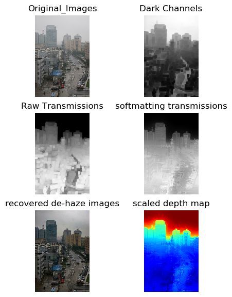

<div align="center">

# 🌫️ PyTorch Single Image Dehazing
### *Dark Channel Prior Implementation*

[](https://pytorch.org/)
[](https://www.python.org/)
[](LICENSE)
[](https://ieeexplore.ieee.org/document/5206515)

**A PyTorch implementation of CVPR 2009 "Single Image Haze Removal Using Dark Channel Prior"**  
✨ *Supports batch-level operations for efficient processing* ✨

[Features](#-features) • [Installation](#-installation) • [Quick Start](#-quick-start) • [Parameters](#-parameters) • [Results](#-results) • [Citation](#-citation)

</div>

---

## 🎯 Features

- ⚡ **Batch Processing**: Efficient batch-level operations for multiple images
- 🔧 **PyTorch Native**: Fully implemented in PyTorch for GPU acceleration
- 📊 **Intermediate Results**: Access to dark channel, transmission map, and depth estimation
- 🎛️ **Customizable**: Adjustable parameters for different dehazing scenarios
- 🚀 **Easy to Use**: Simple API with minimal setup

## 📦 Installation

### Dependencies

```bash
pip install torch torchvision numpy pillow
```

**Required packages:**
- `pytorch` - Deep learning framework
- `numpy` - Numerical computing
- `PIL` (Pillow) - Image processing

### Clone Repository

```bash
git clone https://github.com/Magicboomliu/Pytorch-Version-of-Single-Image-Dehazing-using-Dark-Channel-Prior.git
cd Pytorch-Version-of-Single-Image-Dehazing-using-Dark-Channel-Prior
```

## 🚀 Quick Start

```python
from dehaze_torch import DarkChannelPrior

# Initialize the dehazing model
dehaze_model = DarkChannelPrior(
    kernel_size=15,
    top_candidates_ratio=0.0001,
    omega=0.95,
    radius=40,
    eps=1e-3,
    open_threshold=True,
    depth_est=True
)

# Apply dehazing
dehaze_images, dc, airlight, raw_t, refined_transmission, depth = dehaze_model(image_data_tensor)
```

### 📝 Example Usage

```python
import torch
from PIL import Image
from torchvision import transforms
from dehaze_torch import DarkChannelPrior

# Load and preprocess image
image = Image.open('fogg.png')
transform = transforms.Compose([
    transforms.ToTensor(),
])
image_tensor = transform(image).unsqueeze(0)  # Add batch dimension

# Initialize and run dehazing
dehaze_model = DarkChannelPrior()
dehazed_image, _, _, _, _, _ = dehaze_model(image_tensor)

# Save result
dehazed = transforms.ToPILImage()(dehazed_image.squeeze(0))
dehazed.save('output.png')
```

## 🎛️ Parameters

| Parameter | Type | Default | Description |
|-----------|------|---------|-------------|
| `kernel_size` | int | 15 | Size of the local patch for dark channel computation |
| `top_candidates_ratio` | float | 0.0001 | Ratio of top pixels to estimate atmospheric light |
| `omega` | float | 0.95 | Parameter to keep a small amount of haze (0-1) |
| `radius` | int | 40 | Radius for guided filter |
| `eps` | float | 1e-3 | Regularization parameter for guided filter |
| `open_threshold` | bool | True | Enable thresholding for transmission map |
| `depth_est` | bool | True | Enable depth estimation |

### 🔍 Output Components

The model returns a tuple containing:

1. **`dehaze_images`** - Final dehazed images
2. **`dc`** - Dark channel of the input images
3. **`airlight`** - Estimated atmospheric light
4. **`raw_t`** - Raw transmission map
5. **`refined_transmission`** - Refined transmission map (after guided filtering)
6. **`depth`** - Estimated depth map

## 📊 Results

### Visualization of Dehazing Process

The following image shows the complete dehazing pipeline including intermediate results:



*From left to right: Original hazy image, dark channel, transmission map, refined transmission, and dehazed result*

## 📚 References

This implementation is based on the following papers and repositories:

**Papers:**
- 📄 [Single Image Haze Removal Using Dark Channel Prior](https://ieeexplore.ieee.org/document/5206515) - Kaiming He, Jian Sun, and Xiaoou Tang, CVPR 2009
- 📄 Guided Image Filtering - Kaiming He, Jian Sun, and Xiaoou Tang, ECCV 2010

**Repositories:**
- [He-Zhang/image_dehaze](https://github.com/He-Zhang/image_dehaze)
- [anjali-chadha/dark-channel-prior-dehazing](https://github.com/anjali-chadha/dark-channel-prior-dehazing)

## 📖 Citation

If you find this implementation helpful in your research, please consider citing:

```bibtex
@misc{zihualiu2023DCP,
  title={Pytorch-Version-of-Single-Image-Dehazing-using-Dark-Channel-Prior},
  author={Zihua Liu},
  howpublished={\url{https://github.com/Magicboomliu/Pytorch-Version-of-Single-Image-Dehazing-using-Dark-Channel-Prior}},
  year={2023}
}
```

## 📄 License

This project is licensed under the MIT License - see the [LICENSE](LICENSE) file for details.

---

<div align="center">

**Made with ❤️ by [Zihua Liu](https://github.com/Magicboomliu)**

⭐ Star this repo if you find it useful! ⭐

</div>